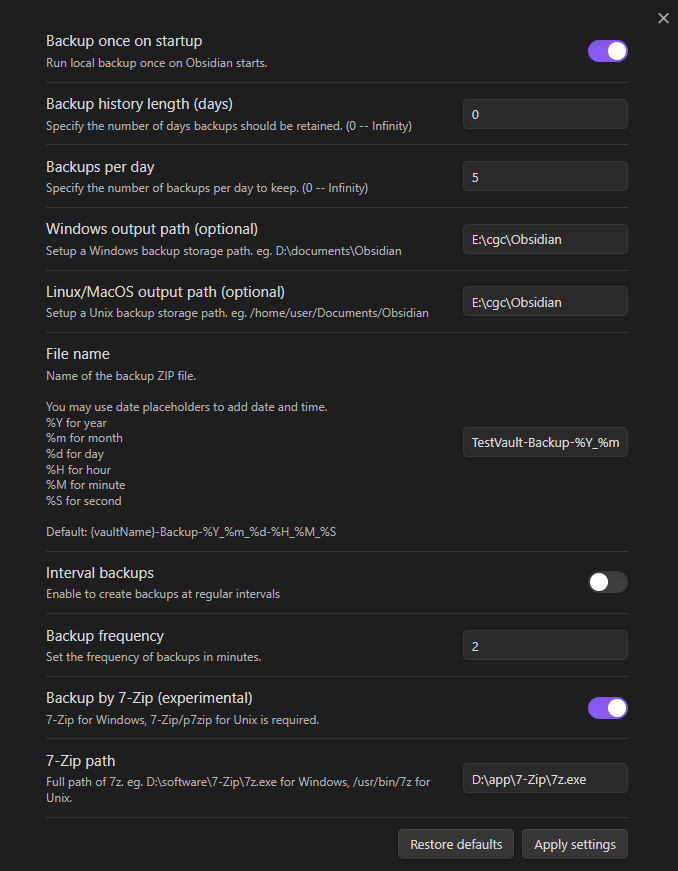

# Local Backup

Automatically creates a local backup of the vault.

## Features

- Backup on startup
- Setup backups' lifecycle
- Customize output path
- Inteval backups

## How to use

### Setup the plugin

> *To apply settings immediately, click the `Apply settings` button.*

> *If you turn on interval backups, it is recommended to set a reasonable bakcup frequency, e.g. >=10min, this plugin costs CPU resources and Disk I/O resources, backup frequently will cause lagging.*

> *For user who owns a vault with large size, it is recommended to close the interval backups and only do a backup on startup.*

### Run a local backup command

Enter the command panel using `Ctrl + p`.

## Installation

### Install from plugin store

- Search `Local Backup` at Obsidian Community Plugins and install it.
- Enable `Local Backup`.
- [Setup](#how-to-use) `Local Backup`.
- Apply settings or restart Obsidian.
- Enjoy! 🎉

### Manually installing the plugin

- Copy over `main.js`, `styles.css`, `manifest.json` to your vault `VaultFolder/.obsidian/plugins/your-plugin-id/`.
- Open Obsidian and enable `Local Backup`.
- Follow the [guiding](#install-from-plugin-store) above.

## Contributing

### Build

- Clone this repo.
- Make sure your NodeJS is at least v16 (`node --version`).
- `npm i` or `yarn` to install dependencies.
- `npm run dev` to start compilation in watch mode.
- `npm run build` to build the `main.js` in `./build`.

## Todo

- [x] Backup on startup.
- [x] Archive the backup dictionary to save disk memory.
- [x] Customize the backup lifecycle.
- [x] Customize the backup storage path.
- [x] Add a command to create a backup.
- [x] Add interval backup.
- [ ] Backup notes without `/.obsidian`.
- [ ] More customization in Settings page.

## Reference

- [adm-zip](https://github.com/cthackers/adm-zip)

## License

**Obsidian Local Backup** is licensed under the MIT license. Refer to [LICENSE](https://github.com/cgcel/obsidian-local-backup/blob/master/LICENSE) for more information.
