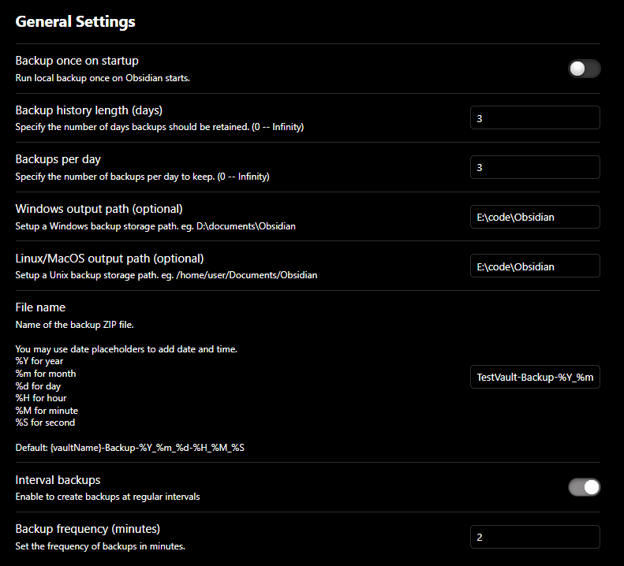
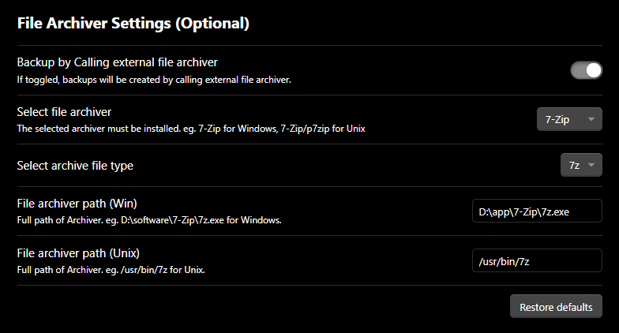
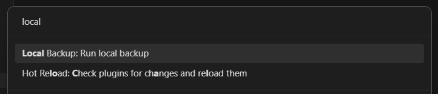
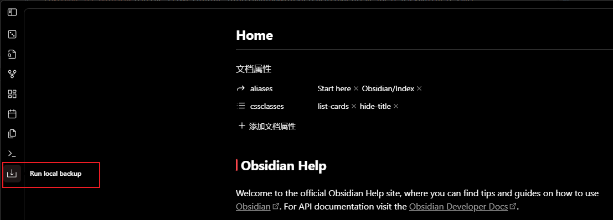

# Local Backup

Automatically creates a local backup of the vault.

## Features

- Backup on startup
- Setup backups' lifecycle
- Customize output path
- Interval backups
- Backup by calling archiver (7-Zip, WinRAR, Bandizip)
- Retry after failures
- Create specific file

## How to use

### Setup the plugin

#### General Settings

##### Hints

1. Setup the output path depends on your computer platform.
2. Setup the Windows and Unix output path while you using these two platforms.

> *If you turn on interval backups, it is recommended to set a reasonable bakcup frequency, e.g. >=10min, this plugin costs CPU resources and Disk I/O resources, backup frequently might cause lagging.*

#### File Archiver Settings (Optional)

##### Hints

1. (Experimental) If you have a large size vault and Obsidian stucks on backing up, please try the experimental feature in setting page.

> *For user who owns a vault with large size, it is recommended to turn on `Backup by calling external file archiver` in setting page, the experimental feature of the latest version, then setup the rest of settings of archiver.*

### Run a local backup command

#### Command panel

Enter the command panel using `Ctrl + P`.

#### Create a specific backup

As you can see in the command panel screenshot above, you are available to create a specific backup file if you want to keep the file. The file created by this command would not delete by the plugin. But you have to name it different from the `File name` setting. (eg. File name: `dev-Backup-%Y_%m_%d-%H_%M_%S`, and your specific file name should not be the same format as File name).

#### Sidebar icon

Click the sidebar icon.

## Installation

### Install from plugin store

- Search `Local Backup` at Obsidian Community Plugins and install it.
- Enable `Local Backup`.
- [Setup](#how-to-use) `Local Backup`.
- Apply settings or restart Obsidian.
- Enjoy! 🎉

### Manually installing the plugin

- Copy over `main.js`, `styles.css`, `manifest.json` to your vault `VaultFolder/.obsidian/plugins/your-plugin-id/`.
- Open Obsidian and enable `Local Backup`.
- Follow the [guiding](#install-from-plugin-store) above.

## Contributing

### Build

**Code contributing is welcome! Just make a PR to master branch directly:)**

- Clone this repo.
- Make sure your NodeJS is at least v16 (`node --version`).
- `npm i` or `yarn` to install dependencies.
- `npm run dev` to start compilation in watch mode.
- `npm run build` to build the `main.js` in `./build`.

## Reference

- [adm-zip](https://github.com/cthackers/adm-zip)
- [7-Zip](https://www.7-zip.org/)
- [WinRAR](https://www.win-rar.com/)
- [Bandizip](https://www.bandisoft.com/)

## Sponsor this project

You could consider buy me a coffee if the plugin saves your time!

## License

**Obsidian Local Backup** is licensed under the MIT license. Refer to [LICENSE](https://github.com/cgcel/obsidian-local-backup/blob/master/LICENSE) for more information.
